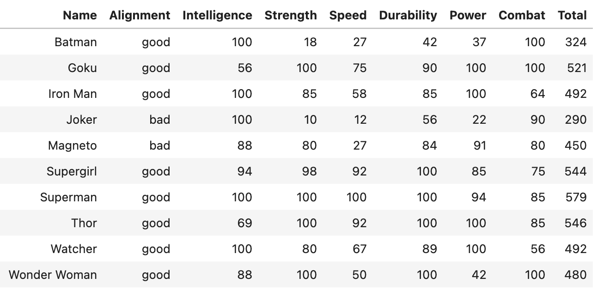
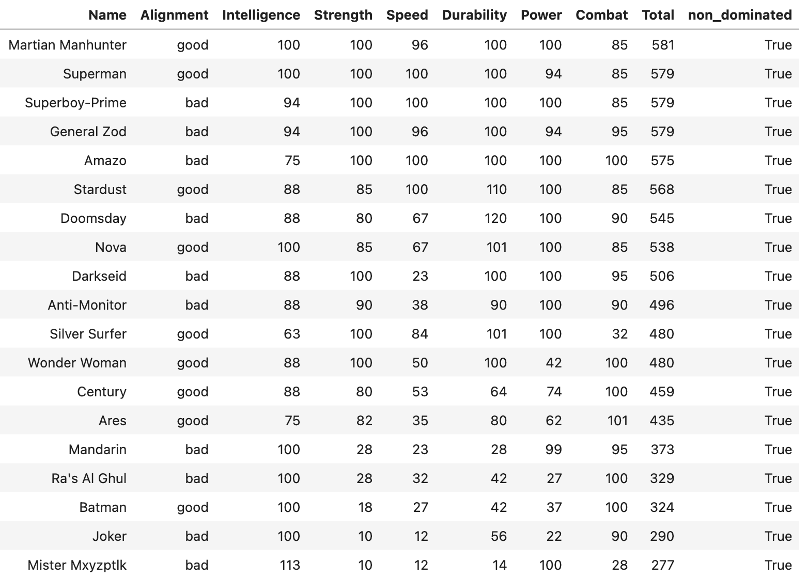

# Listas parcialmente ordenadas, tu nuevo superpoder

Ordenar es bueno. Ordenamos para ganar claridad, priorizar, tomar mejores decisiones, ser más eficientes. Pero muchas veces, la lista que pretendemos ordenar depende de varios factores que se relacionan de manera compleja: entonces un ranking lineal deja de funcionar, por ejemplo:

| Caso | Criterios (↑ = más es mejor · ↓ = menos es mejor) |
|------|-----------------------------------------------------------|
| Evaluar proveedores | Costo ↓, calidad ↑, plazo ↓ |
| Diseñar políticas públicas | Eficacia ↑, costo fiscal ↓, impacto social ↑ |
| Gestionar cartera de seguros | Prima ↑, siniestralidad ↓, volatilidad ↓ |
| Priorizar tickets de soporte | Severidad ↑, impacto cliente ↑, esfuerzo ↓ |
| Comparar ofertas de empleo | Salario ↑, tiempo de traslado ↓, beneficios ↑ |
| Evaluación de estrategias de marketing | ROI ↑, coste por adquisición ↓, tiempo de ejecución ↓ |

Un proveedor barato solo vale la pena si también entrega a tiempo y con la calidad exigida; una política pública resulta atractiva solo si combina alto impacto social con bajo costo fiscal. Con varios criterios tirando en sentidos distintos, forzar un ranking único distorsiona la realidad: siempre aparece alguna ventaja cruzada que lo cambia todo. La alternativa no es ordenar de arriba abajo, sino construir una **lista parcialmente ordenada** (**POSET**) que señala qué opciones son _objetivamente superiores_ y cuáles quedan en un _empate legítimo_.

---
## El caso de los superhéroes

Antes de explicar el método, veamos un caso. Tenemos 611 superhéroes y supervillanos. ¿Quién es el mejor?

&nbsp;

&nbsp;

Cada personaje tiene _6 atributos medibles_: _inteligencia, fuerza, velocidad, resistencia, poder_ y _combate_. Podríamos sumarlos para obtener un “_Total”_, pero ese único número mezcla atributos que son incomparables: ¿vale lo mismo un punto de _fuerza_ que uno de _inteligencia_? Con diez personajes podríamos debatirlo; pero con 611, se vuelve inviable.

## POSET
Aquí entra **POSET**. Su idea central es la *dominancia parcial*: A _domina_ a B si:
1. A no es peor que B en **ningún** atributo.
2. A supera a B en **al menos uno**.

Solo si **ambas** condiciones se cumplen, A _domina_ a B y B queda descartado. Si falta una, los dos personajes siguen en juego como **incomparables**: cada uno brilla en aspectos distintos.

En otras palabras, un elemento queda _dominado_ únicamente cuando existe otro que lo iguala en todo y lo supera en algo. El resultado no es un ranking forzado, sino un **filtro** que deja sobre la mesa solo a los verdaderos contendientes.

En nuestro ejemplo de 10 superhéroes,  

| Ejemplo | ¿Qué ocurre? |
|----------------------------|--------------|
| *Superman* vs. *Magneto* | Superman domina: es igual-o-mejor en todo. |
| *Superman* vs. *Batman*  | Incomparables: Batman tiene Combate 100 vs 85. |
| *Thor* vs. *Goku*        | Incomparables: Thor gana en Resistencia/Poder, Goku en Inteligencia/Combate. |

La gran fortaleza de usar **Listas Parcialmente Ordenadas** es que nos ayuda a encontrar los _elementos “maximales”_. Son esos elementos que nadie domina. En términos de Pareto, son los elementos óptimos: puntos donde ya no se puede subir en un criterio sin bajar en otro. Al quedarnos con ese conjunto limpio de alternativas, sólo comparamos entre las mejores compensaciones posibles y descartamos de un golpe todo lo que es objetivamente inferior.

&nbsp;

&nbsp;

Al aplicar **POSET** al conjunto de 611 superhéroes y villanos, solo 19 quedaron en pie: son los __elementos maximales__. Para cualquiera de ellos no existe otro personaje que sea igual o mejor en todos los atributos y estrictamente mejor en alguno. En otras palabras, no hay forma de mejorar un atributo sin sacrificar otro: estos 19 representan la verdadera frontera de eficiencia dentro del universo.

### Conclusiones

* **El filtro es drástico**, sólo 19 de 611 (≈ 3 %) sobreviven a la _prueba de dominancia_. Todo el resto queda **objetivamente superado** en al menos un atributo sin compensar el resto.
* Conviven dos **perfiles muy distintos**: Titanes como Superman, Martian Manhunter, Superboy-Prime… que aplastan en varios frentes a la vez; Especialistas, como Batman, Joker, Ra’s al Ghul que destacan tanto en Inteligencia o Combate que nadie logra mejorarles sin perder en otro atributo.  
* **No existe hay “mejor absoluto”**: La presencia de Batman junto a entidades cósmicas demuestra que, sin pesos explícitos, el concepto de “mejor” depende del atributo que valores. **POSET** conserva esa diversidad en lugar de esconderla tras un único número.  
* **Se reduce el ruido**, el debate es más claro: reducir la lista de 611 a 19 candidatos transforma un problema inmanejable en una conversación enfocada. Aun así, la decisión final queda abierta, pero ahora es mucho más transparente.

Los conjuntos parcialmente ordenados son ideales cuando los criterios chocan y un ranking lineal falsea la realidad. **POSET** no entrega un ganador único; revela el subconjunto de opciones que nadie puede refutar. La elección final ‒qué atributo priorizar‒ seguirá siendo subjetiva, pero gracias a la **dominancia parcial** sabemos con certeza que todo lo que quedó fuera ya era, objetivamente, subóptimo.

### ¿Querés probarlo por tu cuenta?

Encontrarás el notebook completo y el dataset en mi repositorio de GitHub: [[github.com/Igna-M/algoritmos/poset-superheroes](https://github.com/Igna-M/algoritmos/poset-superheroes)]. Clonalo, cambia los criterios y mirá cómo varía la frontera eficiente en tu propio contexto.

### Fuentes

- [Conjunto parcialmente ordenado — Wikipedia](https://es.wikipedia.org/wiki/Conjunto_parcialmente_ordenado)  
- [POSET Representations in Python Can Have a Huge Impact on Business — *Towards Data Science*](https://towardsdatascience.com/poset-representations-in-python-have-huge-impact-on-business/)

